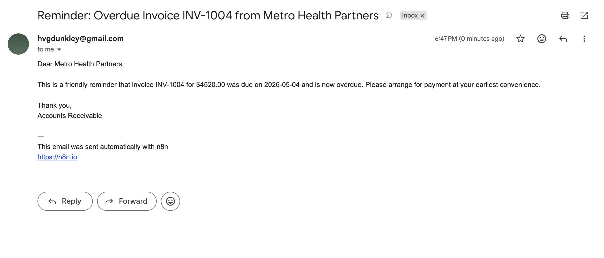
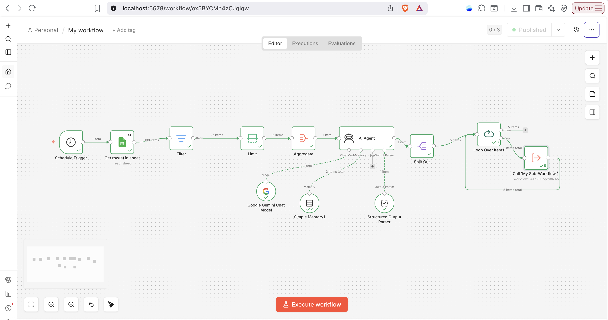
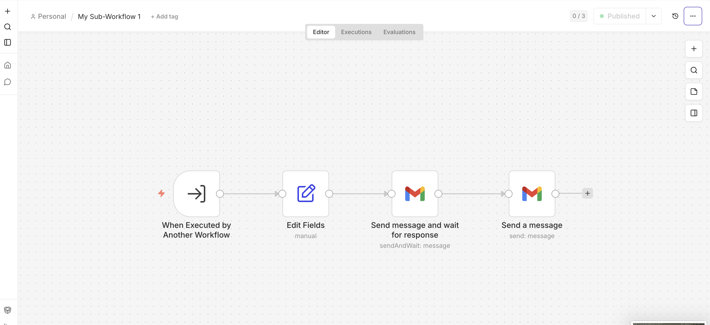
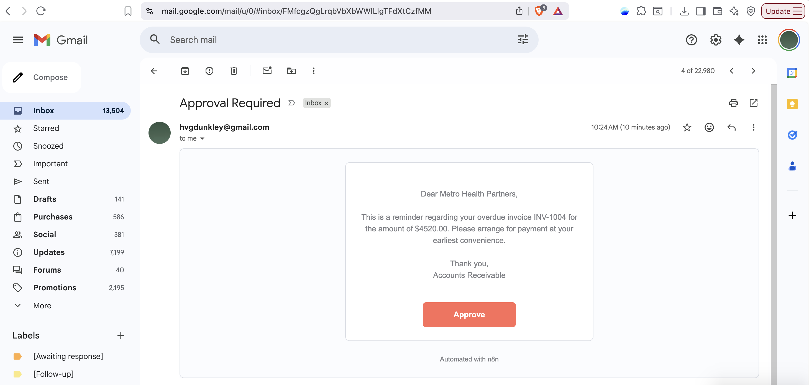

# AI-Powered Invoice Reminder Workflow with n8n + Gemini

## What This Workflow Does

This workflow automates overdue invoice reminders by:
- reading overdue invoices from Google Sheets
- generating personalized reminder emails with Gemini AI
- routing each email through a human approval step
- sending approved emails sequentially through Gmail

The system supports structured AI outputs, sequential processing, and human-in-the-loop approval workflows.

## Concepts Demonstrated

- AI workflow orchestration
- Structured JSON generation
- Human-in-the-loop approval systems
- Sequential batch processing
- Subworkflow execution in n8n
- API integration
- Error handling and debugging
- Stateful workflow execution

## Tech Stack
- n8n
- Google Gemini API
- Gmail API
- Google Sheets API
- Structured Output Parser

## Workflow Architecture
1. Pull overdue invoices from Google Sheets
2. Aggregate invoice records
3. Generate AI email drafts
4. Parse structured JSON output
5. Split customer records into individual items
6. Human approval step
7. Send approved emails

 
## Full Workflow Architecture

## Output 

## Human In the Loop Sub Workflow Image

## Human In the Loop Approval Email

## Lessons Learned

This project highlighted several workflow engineering challenges:

- preserving state across approval nodes
- handling array vs item-based execution in n8n
- maintaining schema consistency with LLM outputs
- debugging sequential processing loops
- managing AI-generated structured outputs reliably

## Setup

1. Import the workflow JSON files into n8n
2. Configure:
   - Gemini API credentials
   - Gmail credentials
   - Google Sheets credentials
3. Update the Google Sheet with invoice data
4. Execute the main workflow

## Future Improvements

- persistent approval dashboard
- Slack/Teams approval integration
- retry and escalation logic
- database-backed invoice tracking
- support for multiple reminder stages
- deployment with Docker

